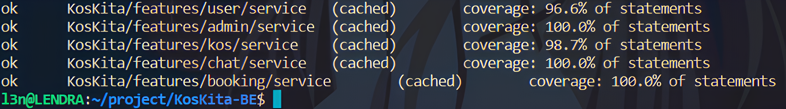

# KosKita API
  <h1>Welcome to KosKita</h1>

<!-- PROJECT LOGO -->


## 📑 About the Project
KosKita adalah aplikasi yang dirancang untuk memudahkan pengguna dalam mencari dan memesan kos. Aplikasi ini menawarkan berbagai fitur yang memudahkan pengguna dalam melakukan transaksi, mulai dari pencarian kos hingga pembayaran

## 🌐 Deployment
 - [VERCEL](https://koskita.netlify.app/)

## 🖼 Prototype
- [FIGMA](https://www.figma.com/file/SLA82Dp0aP8QOWOSRlJqCE/Kost?type=design&node-id=102%3A323&mode=design&t=NVcmjZWyVzodr9FS-1)

## 🤝 Collaboration
- [Github Repository for the team](https://github.com/Kos-Kita/)
- [Discord](https://discord.com/)

### ⚙ Backend
- [Github Repository for the Backend team](https://github.com/Kos-Kita/KosKita-BE)
- [Swagger OpenAPI](https://app.swaggerhub.com/apis-docs/L3NONEONE_1/KosKita/1.0.0#/)
- [Postman Workspace](https://koskita.postman.co/workspace/c8aa6d62-d6b1-489f-8407-086490de72c9)

## 🔮 Features
- 👤Autentikasi dan Manajemen User
    - Registrasi User
    - Login User
    - Mendapatkan Detail User
    - Memperbarui Akun User
    - Memperbarui Sandi User
    - Menghapus User
- 🏠Manajemen Kos
    - Membuat Kos Baru
    - Mendapatkan Semua Kos
    - Mendapatkan Detail Kos
    - Memperbarui Kos
    - Menghapus Kos
    - Mendapatkan Kos Berdasarkan User
    - Mencari Kos
    - Mencari Kos Berdasarkan Filter
- 🖼️Foto Kos
    - Membuat Foto Kos Baru
    - Memperbarui Foto Kos Baru
- ⭐Rating Kos
    - Memberikan Score Rating Untuk Kos
- 📅Proses Booking dan Pembayaran
    - Membuat Booking
    - Membatalkan Booking
    - Mendapatkan Booking User
- 💳Payment Gateway
    - Membuat Pembayaran Booking Baru
    - Membatalkan Pembayaran Booking
    - Menerima Notifikasi Pembayaran
- 💬Real-time Chat
    - Membuat Ruangan Chat Baru
    - Mendapatkan Ruangan Chat Yang Dimiliki User
    - Bergabung Ke Ruangan Chat
    - Mendapatkan Semua Pesan Di Ruangan Chat 
- 👮‍♂️Fitur Admin
    - Mendapatkan Total Semua User, Kos, Booking, Dan Total Booking Per Bulan

## 🗺️ ERD
.png)

## ✔️ Unit Testing


## List Endpoint

| Tag | Endpoint |
| --- | --- |
|👤User | `POST /login` |
|👤User | `POST /users` |
|👤User | `GET /users` |
|👤User | `PUT /users` |
|👤User | `DELETE /users` |
|👤User | `PUT /change-password` |
|🏠Kos | `POST /kos` |
|🏠Kos | `PUT /kos/:id` |
|🏠Kos | `GET /kos` |
|🏠Kos | `DELETE /kos/:id` |
|🏠Kos | `GET /kos/:id` |
|🏠Kos | `GET /users/kos` |
|🏠Kos | `GET /kos/search` |
|🖼️Image | `POST /upload-image/:kosid` |
|🖼️Image | `PUT /upload-image/:kosid` |
|⭐Rating | `POST /kos/:id/rating` |
|📅Booking | `POST /booking` |
|📅Booking | `GET /booking` |
|📅Booking | `PUT /booking/:booking_id` |
|💬Message | `POST /create-room` |
|💬Message | `GET /get-room` |
|💬Message | `GET /join-room/:roomId` |
|💬Message | `GET /room/:roomId` |
|👮‍♂️Admin | `GET /admin` |

## 🛠️Teknologi Stack

- **Golang**
    - -> Bahasa pemrograman yang digunakan untuk mengembangkan backend aplikasi.
- **Echo**
    - -> Framework web Go yang digunakan untuk membangun API.
- **Gorilla WebSocket**
    - -> Pustaka Go untuk implementasi protokol WebSocket.
- **GORM** 
    - -> Pustaka ORM (Object-Relational Mapping) untuk Go yang memudahkan interaksi dengan database.
- **MySQL**
    - -> Sistem manajemen basis data relasional yang digunakan untuk menyimpan data aplikasi.
- **JWT (JSON Web Token)**
     - -> Standar industri untuk token akses yang digunakan untuk otentikasi dan otorisasi.
- **AWS (Amazon Web Services)**
    - -> Layanan cloud yang digunakan untuk hosting dan layanan lainnya.
- **Cloudinary**
    - -> Platform media cloud yang digunakan untuk manajemen dan penyimpanan gambar.
- **Midtrans**
    - -> Gateway pembayaran yang digunakan untuk memproses transaksi pembayaran.
- **Docker** 
    - -> Platform yang digunakan untuk mengemas aplikasi dan dependensinya dalam bentuk kontainer.
- **Postman**
    - -> Alat pengujian API yang digunakan untuk menguji endpoint API.
- **GitHub**
    - -> Platform pengembangan perangkat lunak yang digunakan untuk kontrol versi dan kolaborasi.

## ✔️ Requirement
Things you need to run the KosKita API
1. **Cloudinary Account**
2. **Midtrans Account**

## 🧰 Installation
Follow these steps to install and set up the KosKita API:
1. **Clone the repository:**

   ```bash
   git clone https://github.com/Kos-Kita/KosKita-BE.git
   
2. **Move to Cloned Repository Folder**

    ```bash
    cd KosKita-BE
    
3. **Update dependecies**
    
    ```bash
    go mod tidy

4. **Create a database** 

5. **Copy `local.env.example` to `.env`**

    ```bash
    cp local.env.example .env
    
6. **Configure your `.env` to configure JWT token, connect to your database, cloudinary, and Midtrans**
7. **Run KosKita API** 
8. 
    ```bash
    go run .

## 🤖 Author

- **Lendra Syaputra** - BE 20 ALTA
  - [Github](https://github.com/lendral3n)
- **Achmad Yoga Prananda** - BE 20 ALTA
  - [Github](https://github.com/elfandor2)